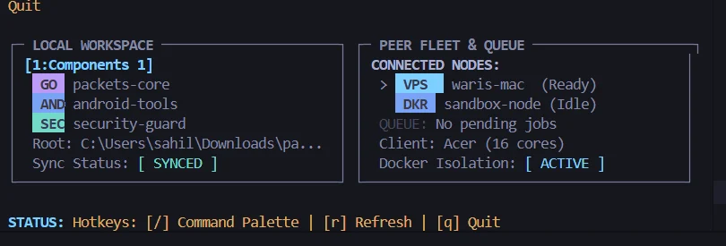
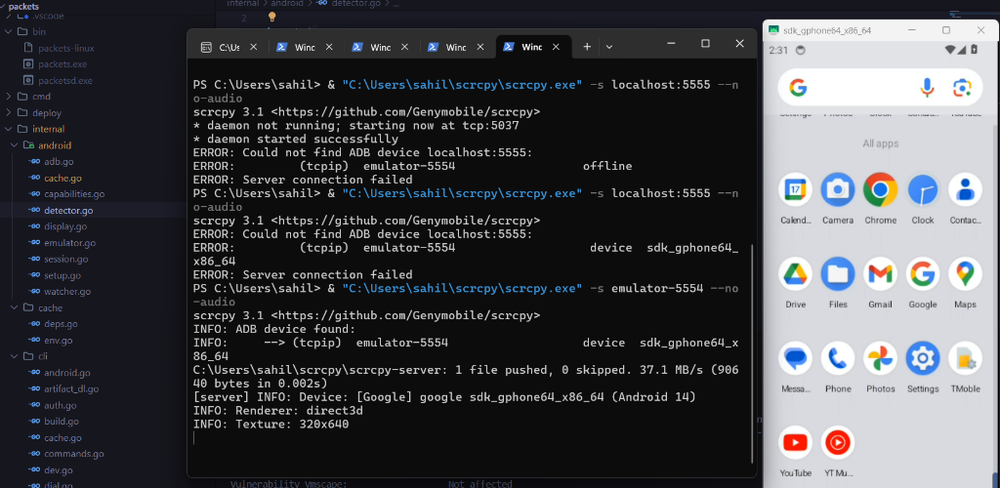
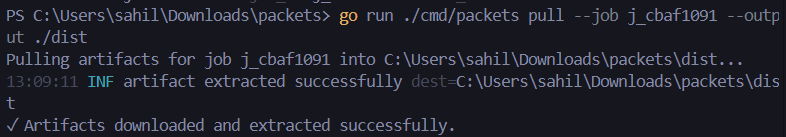

# Packets

Packets is something i started building because my laptop is not really good at doing heavy development work

The idea is to use another machine for the work that needs more resources, while keeping the editor and normal development on my laptop.

It can be used for things like android/gradle builds, rust, go and other more languages projects, test, containers, services, remote commands, and other workflow that are better run on another machine.

## Description
I do most of my coding on an older laptop with only 8gb of ram. Whenever I work on android apps with gradle, build rust crates, or run multiple tests, my laptop starts freezing and getting really slow.

I built packets so I can use my laptop mainly for coding while the heavy work is done on another machine. The builds, container tasks, and tests run on an old desktop on my home network or on a remote vps.

Packets syncs the changes from my laptop, runs the build or tests on the remote machines, streams the output back to my terminal, and brings the built files back when it's done. It also keeps the build cache between runs, so I don't have to start everything from scratch every time.

## How it works
There are two main parts:
- `packets` is the client i use locally.
- `packetsd` runs on the machine that is doing the work.

The client talks to the remote daemon and sends work to it.

A normal build looks roughly like this:
1. Suppose i change something locally.
2. Packets syncs the required project changes to the remote machine.
3. The remote worker runs the build.
4. Build output is streamed back to the local terminal.
5. The resulting files can be brought back to the local project.

### Screenshots

**Peer fleet status & queue dashboard**


**Remote Android emulator session**


**Artifact download after remote build**


## Getting Started

### Dependencies

* Linux, macOS, or Windows
* Go 1.22 or higher (if building from source)
* A remote machine, desktop, or VPS reachable over the network

### Installing

Install the pre-built binary:
```bash
curl -fsSL https://raw.githubusercontent.com/debaucheryparty/packets/main/scripts/install.sh | bash
```

Or install it with Go:
```bash
go install github.com/debaucheryparty/packets/cmd/packets@latest
```

Or build it from source:
```bash
git clone https://github.com/debaucheryparty/packets.git
cd packets
go build -o packets ./cmd/packets
go build -o packetsd ./cmd/packetsd
```

### Setup

1. **Start the daemon** on your remote machine:
```bash
export SCHEDULER_GRPC_PORT=50051
./packetsd
```

2. Then **configure** the local client:
```bash
export PACKETS_SERVER_ADDR="your-remote-host:50051"
packets status
```

3. After the connection is working, **initialize** the project:
```bash
cd your-project
packets init
```

### Executing the program

* Run a remote build (auto-detects project type, uploads changes, and downloads outputs):

```bash
packets build --wait
```

* Run tests on the remote machine:

```bash
packets test
```

* Subspaces:
Create a persistent workspace:
```bash
packets subspace create --project my-app --worker vps-worker
```

Then build using it:
```bash
packets build --subspace sub-xxxxxx --wait
```

* Run any command or open a shell inside the remote workspace:

```bash
packets exec "cargo check"
packets subspace shell sub-xxxxxx
```

* Connect an AI assistant (Claude Desktop, Cursor) via MCP:

```json
{
  "mcpServers": {
    "packets": {
      "command": "packets",
      "args": ["mcp"],
      "env": {
        "PACKETS_SERVER_ADDR": "vps.example.com:50051"
      }
    }
  }
}
```

## AI Usage

I used ai while developing packets. I used it for debugging, understanding errors, exploring implementation options, reviewing code, and working on parts of Mcp and ai agent integration.

I still test the changes myself and make the final decisions about what goes into the project.

## Development

**Packets is still a work in progress** and I am continuously working on it, testing different ideas, researching possible improvements, and trying to add things that make the project more useful.


## Help

Check connection status and cluster health:

```bash
packets status
```

View all available commands and flags:

```bash
packets --help
```

More documentation and architecture notes are available in [docs/](./docs/README.md).

## License

This project is licensed under the MIT License -> see the [LICENSE](LICENSE) file for details.
