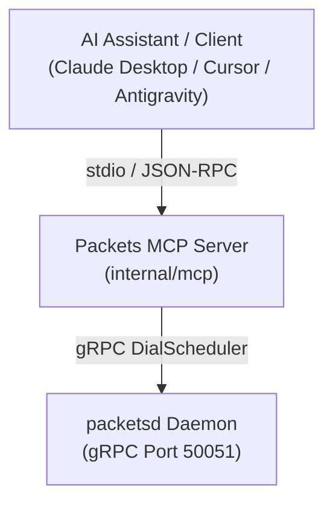

# Model Context Protocol (MCP) Integration

Packets features an integrated Model Context Protocol (MCP) server (`internal/mcp`). This allows AI coding assistants (such as Claude Desktop, Cursor, Antigravity, or custom LLM agents) to autonomously compile code, run tests, manage persistent Subspaces, and inspect worker nodes.

---

## Architecture



The MCP server connects to `packetsd` and exposes tool functions formatted with JSON Schema definitions. Agents can query cluster status, create persistent Subspaces, trigger builds, and stream logs without shelling out to the CLI.

---

## Configuring Your Agent

### Claude Desktop (`claude_desktop_config.json`)

```json
{
  "mcpServers": {
    "packets": {
      "command": "packets",
      "args": ["mcp"],
      "env": {
        "PACKETS_SERVER_ADDR": "127.0.0.1:50051"
      }
    }
  }
}
```

### Cursor (`.cursor/mcp.json`)

```json
{
  "mcpServers": {
    "packets": {
      "command": "packets",
      "args": ["mcp"],
      "env": {
        "PACKETS_SERVER_ADDR": "127.0.0.1:50051"
      }
    }
  }
}
```

---

## Available Capabilities

Through MCP tools, an agent can:
- Check cluster health and available compute capacity before compiling.
- Allocate a dedicated Subspace for a feature branch.
- Trigger incremental builds and inspect compiler diagnostics.
- Stream build logs to identify and resolve compiler errors.
- Destroy Subspaces when development tasks complete.
