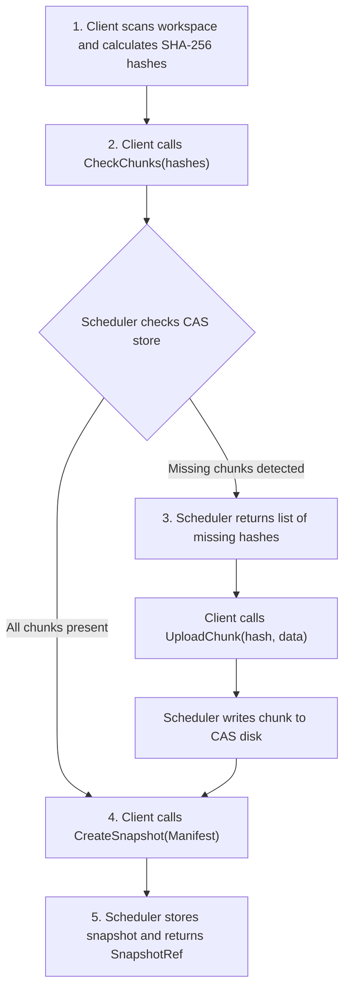

# Content-Addressable Storage & Caching

Packets features an immutable, content-addressable storage (CAS) engine that deduplicates files, minimizes network transfer overhead, and powers incremental compilation.

---

## Workspace Chunking & Merkle Protocol

When `workspace.ScanWorkspace` scans a project:

1. **Ignore Filtering**: Evaluates `.gitignore` and `.packetsignore` rules, skipping `vendor/`, `target/`, `.git/`, `.packets/`, and temporary build outputs.
2. **File Hashing**: Calculates SHA-256 hashes for every file.
3. **Mode Normalization**: Normalizes file permissions across operating systems:
   - Directories: `0o755`
   - Executable wrappers (`gradlew`, `mvnw`, `configure`) and shell scripts (`.sh`, `.bash`): `0o755`
   - Standard source files: `0o644`
4. **Root Hash Calculation**: Produces a deterministic `RootHash` over all sorted file entries.

---

## Delta Synchronization

Rather than archiving and uploading the full project, the client coordinates with `WorkspaceService`:



If you edit a single line in one source file in a 10,000-file repository, only that single file's bytes are compressed and transmitted. All other 9,999 files are linked directly from remote cache.

---

## Local Snapshot Manifest Cache

Clients maintain a `.packets_manifest.json` cache locally:

```json
{
  "root_hash": "ca1abc3030b2b47c44e79712c7d284dc7c081269539c71a168fafab40233f616",
  "snapshot_ref": "783787c436d0fef5a9b017ed328e24dff753fd340994ef0c61c3704e60fc4d1a",
  "uploaded_at": "2026-09-18T15:07:13Z"
}
```

If the client detects that file modtimes and sizes have not changed since the last run, the scan completes in milliseconds without re-hashing unchanged content.
