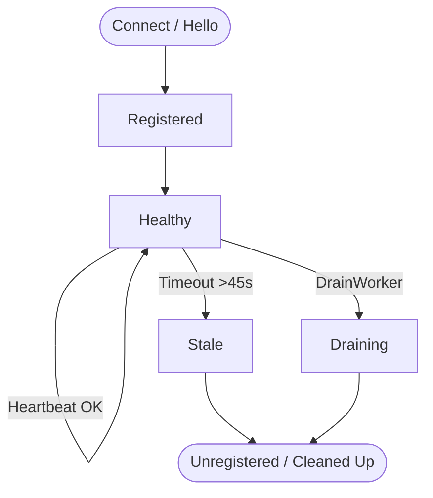

# Worker Pool & Scheduling

The `WorkerPool` in `packetsd` maintains active registrations from compute workers, tracks real-time heartbeat status, and schedules incoming jobs onto the best candidate node.

---

## Scheduling Algorithm

When `Dispatcher.Submit` dispatches a job:

1. **Health Verification**: Only worker nodes with `Healthy == true` and `Draining == false` are eligible.
2. **Capacity Bounds**: Workers reject tasks if `ActiveJobs >= MaxJobs`.
3. **Least-Loaded Scheduling**: Among eligible workers, the node with the lowest current active load (`min(ActiveJobs)`) is selected.
4. **Retry Mechanism**: If a worker fails to acknowledge execution or disconnects unexpectedly, the scheduler automatically retries the task up to 2 times on alternate healthy workers before failing the job.

---

## Worker Lifecycle



### Heartbeats & Eviction
Workers send periodic heartbeat pings via `RegisterWorkerStream`. The scheduler tracks `LastHeartbeat` timestamps:

- If a heartbeat is missed for **45 seconds**, the worker is marked stale and automatically evicted from scheduling.
- If a worker terminates gracefully, it signals draining mode so no new tasks are dispatched to it.

---

## Draining a Worker Node

Before taking a compute worker offline for maintenance or rebooting:

```go
// Worker pool sets draining state to finish active jobs safely
workerPool.DrainWorker(workerID)
```

The worker finishes executing its currently assigned jobs, closes streams, and gracefully unregisters from the scheduler.
